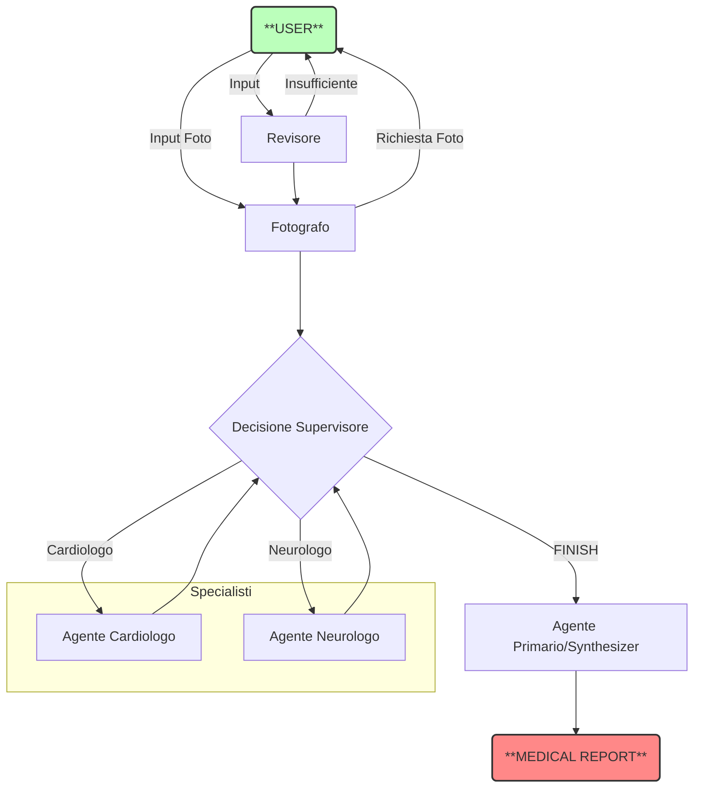
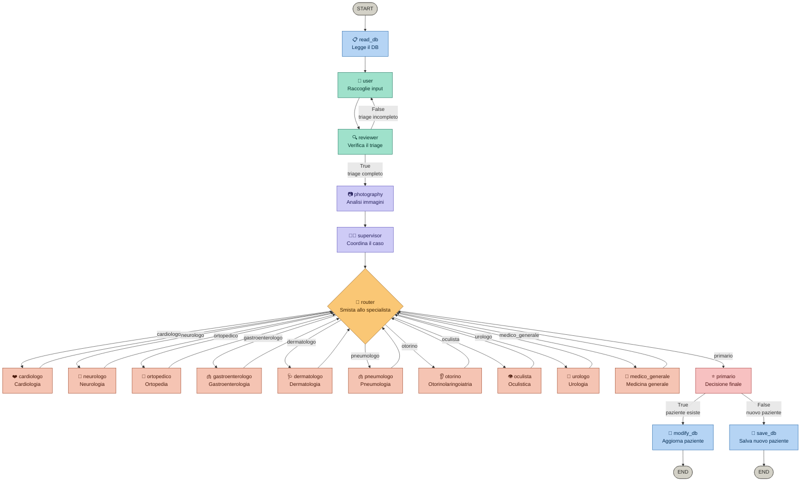

# 🩺 VITA - Virtual Intelligent Triage Assistant

**VITA** (Virtual Intelligent Triage Assistant) è un sistema avanzato di **Multi-Agent AI** progettato per simulare un processo di triage medico di emergenza.

Costruito interamente in Python utilizzando **LangGraph** e **LangChain**, il sistema orchestra una squadra di agenti AI specializzati (alimentati da **Llama 3** via Ollama) che collaborano per analizzare i sintomi, formulare diagnosi differenziali e assegnare un codice di priorità.

---

## 🚀 Caratteristiche Principali

* **🧠 Architettura Multi-Agente:** Utilizza il pattern *Supervisor-Worker*. Un agente supervisore coordina il flusso, attivando specialisti (Cardiologo, Neurologo) solo quando necessario.
* **🔒 Privacy-First:** Esegue l'intero processo in locale utilizzando **Ollama** e per migliorare la velocità esegue tramite *API-KEY* su architettura **GROQ**.
* **📝 Memoria di Stato Persistente:** Grazie a `MedicalState`, il sistema mantiene una cronologia coerente ("general_hisory") di tutta la conversazione tra gli agenti.
* **📄 Output Strutturato:** Fornisce un report clinico finale chiaro

---

## 🛠️ Architettura del Sistema

Il progetto si basa su un grafo a stati (**StateGraph**) che gestisce il flusso decisionale:



---

## I Ruoli degli Agenti (Nodi)
1. **🧐 Revisore**: Analizza l'input e determina se sono necessari altre informazioni
2. **📸 Fotografo**: Analizza una foto in input e da una descrizione dettagliata e oggettiva dell'elemento della foto
3. **👮 Supervisor (Router)**: Analizza l'input e decide quale specialista consultare o se terminare il consulto.
4. **🫀 Cardiologo**: Specialista in patologie cardiovascolari. Interviene su dolori toracici, aritmie, dispnea.
5. **🧠 Neurologo**: Specialista in patologie del sistema nervoso. Interviene su emicranie, svenimenti, parestesie.
6. **👨‍⚕️ Primario (Synthesizer)**: Non dialoga. Rilegge l'intera conversazione tra gli specialisti e compila il Referto Clinico finale.

## 📂 Struttura del Progetto
```bash
    VITA/
    ├── main.py         # Entry point: costruisce ed esegue il Grafo
    ├── nodes.py        # Logica degli agenti (funzioni dei nodi)
    ├── state.py        # Definizione della struttura dati (MedicalState)
    ├── config.py       # Gestione dei Prompt e configurazione Modello
    └── README.md       # Documentazione
```

## ▶️ Utilizzo
Avvia il sistema eseguendo il file principale:
```bash
    python main.py
```
Il terminale chiederà di inserire i sintomi del paziente. **Esempio**:
*"Il paziente lamenta forte dolore al petto irradiato al braccio sinistro e sudorazione fredda."*
Il sistema mostrerà a schermo il ragionamento degli agenti in tempo reale e concluderà con il referto.

## ⚙️ Personalizzazione
Cambiare modello o modificare il comportamento?
- Cambiare Modello (es. Mistral, Gemma): Modifica la variabile llm in nodes.py.
- Modificare i Prompt: Vai su config.py per cambiare le istruzioni date agli specialisti o le regole di assegnazione dei codici colore.

## Prova
# Grafo LangGraph – MedicalState

Schema del grafo di stato LangGraph per il sistema medico multi-agente.



---

## Legenda

| Colore | Categoria | Nodi |
|--------|-----------|------|
| 🔵 Blu | Persistenza DB | `read_db`, `save_db`, `modify_db` |
| 🟢 Verde acqua | Input / revisione | `user`, `reviewer` |
| 🟣 Viola | Supervisione e analisi | `photography`, `supervisor` |
| 🟠 Ambra | Router decisionale | `router` |
| 🩸 Coral | Specialisti medici | tutti i 10 specialisti |
| 🟥 Rosso | Decisione finale | `primario` |
| ⬜ Grigio | Entry / exit point | `START`, `END` |

---

## Archi condizionali

| Nodo | Condizione | Ramo True | Ramo False |
|------|-----------|-----------|------------|
| `reviewer` | `triage_complete` | → `photography` | → `user` (loop) |
| `primario` | `patient_exists` | → `modify_db` | → `save_db` |

---

## Configurazione tecnica

```python
memory = MemorySaver()
graph = workflow.compile(
    checkpointer=memory,
    interrupt_before=["user"]  # pausa prima di raccogliere input utente
)
```

- **Checkpointer**: `MemorySaver` — persistenza in memoria degli stati intermedi
- **Interrupt**: il grafo si interrompe prima del nodo `user` per attendere l'input umano
- **Ciclo specialisti**: tutti i nodi specialista (tranne `primario`) riportano al `router`, permettendo consulenze multiple prima della decisione finale