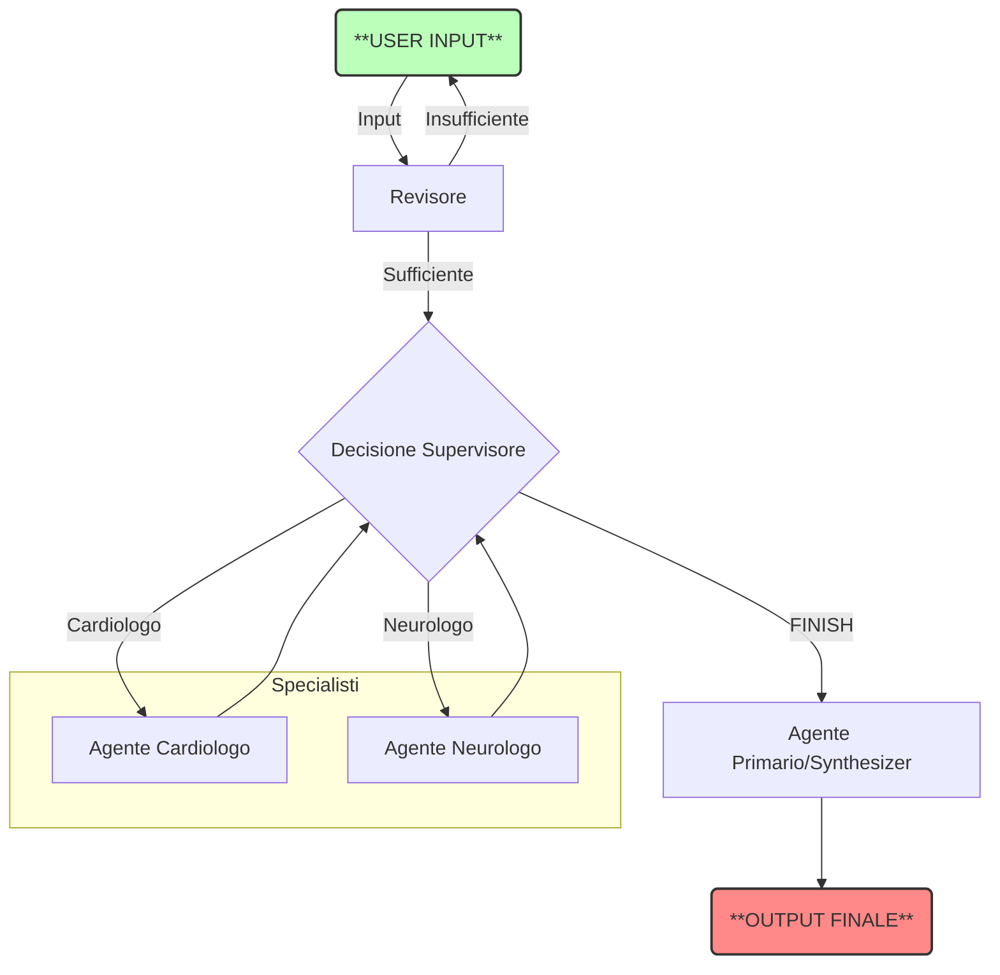

# 🩺 VITA - Virtual Intelligent Triage Assistant

**VITA** (Virtual Intelligent Triage Assistant) è un sistema avanzato di **Multi-Agent AI** progettato per simulare un processo di triage medico di emergenza.

Costruito interamente in Python utilizzando **LangGraph** e **LangChain**, il sistema orchestra una squadra di agenti AI specializzati (alimentati da **Llama 3** via Ollama) che collaborano per analizzare i sintomi, formulare diagnosi differenziali e assegnare un codice di priorità.

---

## 🚀 Caratteristiche Principali

* **🧠 Architettura Multi-Agente:** Utilizza il pattern *Supervisor-Worker*. Un agente supervisore coordina il flusso, attivando specialisti (Cardiologo, Neurologo) solo quando necessario.
* **🔒 Privacy-First:** Esegue l'intero processo in locale utilizzando **Ollama**, garantendo che nessun dato sensibile lasci la macchina.
* **📝 Memoria di Stato Persistente:** Grazie a `MedicalState`, il sistema mantiene una cronologia coerente ("memory") di tutta la conversazione tra gli agenti.
* **🚦 Triage Deterministico:** Separa la logica clinica (diagnosi) dalla logica di classificazione (codice colore), garantendo valutazioni di gravità più sicure e strutturate.
* **📄 Output Strutturato:** Fornisce un report clinico finale chiaro e un codice colore standard (Rosso, Giallo, Verde, Bianco).

---

## 🛠️ Architettura del Sistema

Il progetto si basa su un grafo a stati (**StateGraph**) che gestisce il flusso decisionale:



## I Ruoli degli Agenti (Nodi)
1. **👮 Supervisor (Router)**: Analizza l'input e decide quale specialista consultare o se terminare il consulto.
2. **🫀 Cardiologo**: Specialista in patologie cardiovascolari. Interviene su dolori toracici, aritmie, dispnea.
3. **🧠 Neurologo**: Specialista in patologie del sistema nervoso. Interviene su emicranie, svenimenti, parestesie.
4. **👨‍⚕️ Primario (Synthesizer)**: Non dialoga. Rilegge l'intera conversazione tra gli specialisti e compila il Referto Clinico finale.

## 📂 Struttura del Progetto
```bash
    VITA/
    ├── main.py         # Entry point: costruisce ed esegue il Grafo
    ├── nodes.py        # Logica degli agenti (funzioni dei nodi)
    ├── state.py        # Definizione della struttura dati (MedicalState)
    ├── config.py       # Gestione dei Prompt e configurazione Modello
    └── README.md       # Documentazione
```

## ▶️ Utilizzo
Avvia il sistema eseguendo il file principale:
```bash
    python main.py
```
Il terminale chiederà di inserire i sintomi del paziente. **Esempio**:
*"Il paziente lamenta forte dolore al petto irradiato al braccio sinistro e sudorazione fredda."*
Il sistema mostrerà a schermo il ragionamento degli agenti in tempo reale e concluderà con il referto.

## ⚙️ Personalizzazione
Cambiare modello o modificare il comportamento?
- Cambiare Modello (es. Mistral, Gemma): Modifica la variabile llm in nodes.py.
- Modificare i Prompt: Vai su config.py per cambiare le istruzioni date agli specialisti o le regole di assegnazione dei codici colore.